# k9-punsj

Håndterer manuell `punching` av søknader, tilleggsinformasjon og avklaringer som kommer inn for ytelser i Kapittel 9 og som ikke kan avklares av k9-fordel.

[](https://github.com/navikt/k9-punsj/actions?query=workflow%3A%22Build+master%22)

## Bygge lokalt
```
export GITHUB_USERNAME=x-access-token
export GITHUB_PASSWORD=et-personal-access-token-med-read-packages-tilgang
./mvnw clean install --settings .m2/settings.xml 
```

Eventuelt om du har satt opp username password for server med id `github` i din lokale settings.xml som håndterer dette.

## Starte lokalt
Bruk klassen `K9PunsjApplicationWithMocks` som en del av `test`

## Databasetilgang
```
export VAULT_ADDR=https://vault.adeo.no
vault login -method=oidc
vault read postgresql/preprod-fss/creds/k9-punsj-user
```

## Swagger lokalt
Bruk header fra Nav token header i authorize
[Swagger](http://localhost:8085/internal/webjars/swagger-ui/index.html?configUrl=/internal/api-docs/swagger-config)

## Accesstoken lokalt
Husk å være logget inn på [localhost](http://localhost:8085) først, så gå til 
[Nav token header](http://localhost:8085/api/oidc/hentNavTokenHeader)
for å hente token som kan brukes i swagger.

## Swagger i dev
Bruk header fra Nav token header i authorize.
[Swagger](https://k9-punsj.dev.adeo.no/internal/webjars/swagger-ui/index.html?configUrl=/internal/api-docs/swagger-config)

## Accesstoken i dev
Husk å være logget inn på [dev](https://k9-punsj.dev.adeo.no/) først, så gå til 
[Nav token header](https://k9-punsj-oidc-auth-proxy.dev.adeo.no/api/oidc/hentNavTokenHeader)
for å hente token som kan brukes i swagger.

## Åpne
Link til k9-punsj skjemaer:
[http://localhost:8085](http://localhost:8085)

## Systemarkitektur
Det brukes mermaid for å generere diagrammer. For å komme i gang, installer [mermaid-cli](https://github.com/mermaid-js/mermaid-cli#install-globally).
For mer info se [mermaid-js](https://mermaid-js.github.io/mermaid/#/)
For å oppdatere eller generere systemcontext, kan du kjøre kommandoen:
```shell
mmdc -i docs/systemcontext.mmd -o docs/systemcontext.svg
```

For å opprette nye diagrammer, kan du opprette en ny *.mmd-fil og deretter kjøre kommandoen nevnt over (med navnet på den nye filen) under mappen /docs.

### Systemkontekst


## Henvendelser
 Spørsmål knyttet til koden eller prosjektet kan stilles som issues her på GitHub.
 
 Interne henvendelser kan sendes via Slack i kanalen #sif_saksbehandling. 


