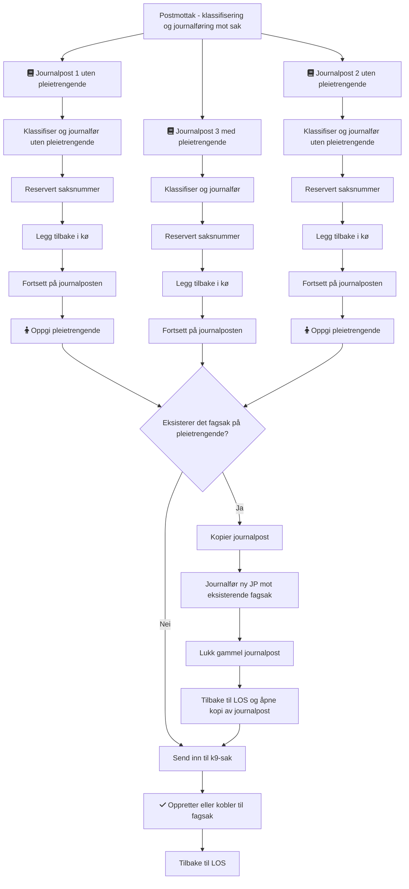

# k9-punsj

Håndterer manuell `punching` av søknader, tilleggsinformasjon og avklaringer som kommer inn for ytelser i Kapittel 9 og som ikke kan avklares av k9-fordel.

[](https://github.com/navikt/k9-punsj/actions?query=workflow%3A%22Build+master%22)

---
## Kode
### Postmottak
Flyt for klassifisering av journalposter mot sak.

Link til [mermaid](https://mermaid.live/edit#pako:eNqdVcFy2jAQ_RWNzuGAfCqHdpIASYAWpuRUk8kIvDaqbMkjy-lkCJ-Tf8idH8vKWDi0QJhyALP73u76vbW8ogsdAe3QONV_FktuLLnvzhTBzySc6MJm2louSYvIlBeFiEUBRqiE6IT81qVRPI03b1UEkaTg8qFmk1brKxlM2mHMOzFvzbWWZLBl5FiXtElpQZE8BQHWgEpARVCTkebpl-GwafxX19MVLn2Jq_AnIPkJTDVgocosA9MArzzwOhxBkhAr0jmXQASRm7cGdu1h3bCvjS3AWpJvXv1A7qZANfCuh_dqBRZLkUZknOeJODpzryL1p-19EdkxEdlJCZin_7eIzIvIPhGReRHZSRGZF5GdJSLzIrKzRUTtHOflB4gXR-yHU8wSoZQbicgvrWZHXdo3uNk1gIV0DQyOhmJBmuK31HP34yrEPPl3y4NjBgUkg-iYuoFnn_KnQXsvgk-8CLwXwUkvAu9FcJYXQXd_N50pPrLqyUIg2uD0Edhao6rY_q1_W--7NOCVSbfhUOcCyR9aNx7deo_uwsGHvVXPGKtOHfDdscO-P47kn0M2CEellCThqFZ6sBViavTjcDy5exyNp-F9LZ7zHv87dzavuQLciVwQ_nSw0I7uR-9vM7upbqrEgfoP9IKimRkXEZ7KK0eYUbuEDGa0g5cRN3JGZ2qNOF5aPX1WC9qxpoQLWuYRt9AVPDE8o7iPabGL9iJhtdkFc65-ad2AoEp_374LqlfC-h0-pgEM) for å redigere diagrammet.

## Deployment

Push til master deployer til dev-miljø.

Deploy til prod via Github action `Deploy to prod`

## Databasetilgang
```
export VAULT_ADDR=https://vault.adeo.no
vault login -method=oidc
vault read postgresql/preprod-fss/creds/k9-punsj-user
```


## Lokal kjøring

---
### Bygge lokalt
```
export GITHUB_PASSWORD=et-personal-access-token-med-read-packages-tilgang
mvn clean install --settings .m2/settings.xml 
```

Eventuelt om du har satt opp username password for server med id `github` i din lokale settings.xml som håndterer dette.

### Starte lokalt
Bruk klassen `K9PunsjApplicationWithMocks` som en del av `test`

### Swagger lokalt
Bruk header fra Nav token header i authorize
[Swagger](http://localhost:8085/internal/webjars/swagger-ui/index.html?configUrl=/internal/api-docs/swagger-config)

### Accesstoken lokalt
Husk å være logget inn på [localhost (frontend)](http://localhost:8080) først.
Tokenet kan du finne i loggen til azure-mock kjørende i docker-compose.
Søk etter ", assertion=" i loggen og kopier innholdet mellom firkantparantesen. Altså, den siste assertion som ble logget.
Eksempel: `, assertion=[eyJr...]`

### Åpne
Link til k9-punsj skjemaer:
[http://localhost:8080](http://localhost:8080)

---
## Tilgang i miljø

### Swagger i dev
Bruk header fra Nav token header i authorize.
[Swagger](https://k9-punsj.dev.intern.nav.no/internal/webjars/swagger-ui/index.html?configUrl=/internal/api-docs/swagger-config)

### Accesstoken i dev
Husk å være logget inn på [dev](https://k9-punsj-frontend.intern.dev.nav.no/) først, så gå til 
[Nav token header](https://k9-punsj-frontend.intern.dev.nav.no/api/k9-punsj/oidc/hentNavTokenHeader)
for å hente token som kan brukes i swagger.

### Kafka manager for lesing av meldinger i dev
Finns tilgjenglig på [k9-kafka-manager](https://k9-kafka-manager.intern.dev.nav.no/index.html), tilgang for alle i team k9saksbehandling. (Logge in med nav.no-mail)

---
## Henvendelser
 Spørsmål knyttet til koden eller prosjektet kan stilles som issues her på GitHub.
 
 Interne henvendelser kan sendes via Slack i kanalen #sif_saksbehandling. 


