# k9-punsj


## Systemarkitektur
Det brukes mermaid for å generere diagrammer. For å komme i gang, installer [mermaid-cli](https://github.com/mermaid-js/mermaid-cli#install-globally).
For mer info se [mermaid-js](https://mermaid-js.github.io/mermaid/#/)
For å oppdatere eller generere systemcontext, kan du kjøre kommandoen:
```shell
mmdc -i docs/systemcontext.mmd -o docs/systemcontext.svg
```

For å opprette nye diagrammer, kan du opprette en ny *.mmd-fil og deretter kjøre kommandoen nevnt over (med navnet på den nye filen) under mappen /docs.

### Systemkontekst

---



### Database

---

